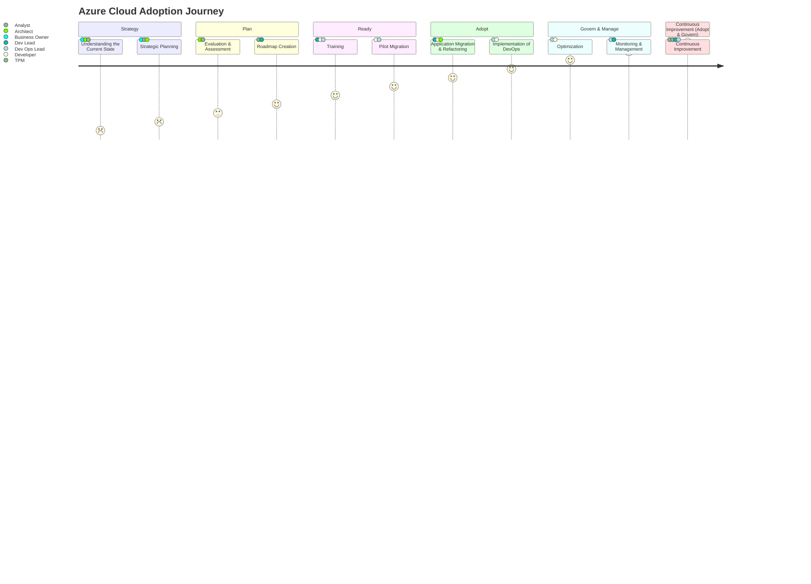

# testflux2

```mermaid
journey
title Azure Cloud Adoption Journey
section Strategy
Understanding the Current State: 1: Business Owner, Architect, Analyst
Strategic Planning: 2: Business Owner, TPM, Architect
section Plan
Evaluation & Assessment: 3: Architect, Analyst
Roadmap Creation: 4: TPM, Dev Lead
section Ready
Training: 5: Dev Lead, Developer, Dev Ops Lead
Pilot Migration: 6: Developer, Dev Ops Lead
section Adopt
Application Migration & Refactoring: 7: Dev Lead, Developer, Architect
Implementation of DevOps: 8: Dev Ops Lead, Developer
section Govern & Manage
Optimization: 9: Dev Ops Lead, Developer
Monitoring & Management: 10: Dev Ops Lead, Dev Lead
section Continuous Improvement (Adopt & Govern)
Continuous Improvement: 11: Analyst, TPM, Dev Lead, Dev Ops Lead
```

```mermaid
graph TD;
    A-->B;
    A-->C;
    B-->D;
    C-->D;
```
